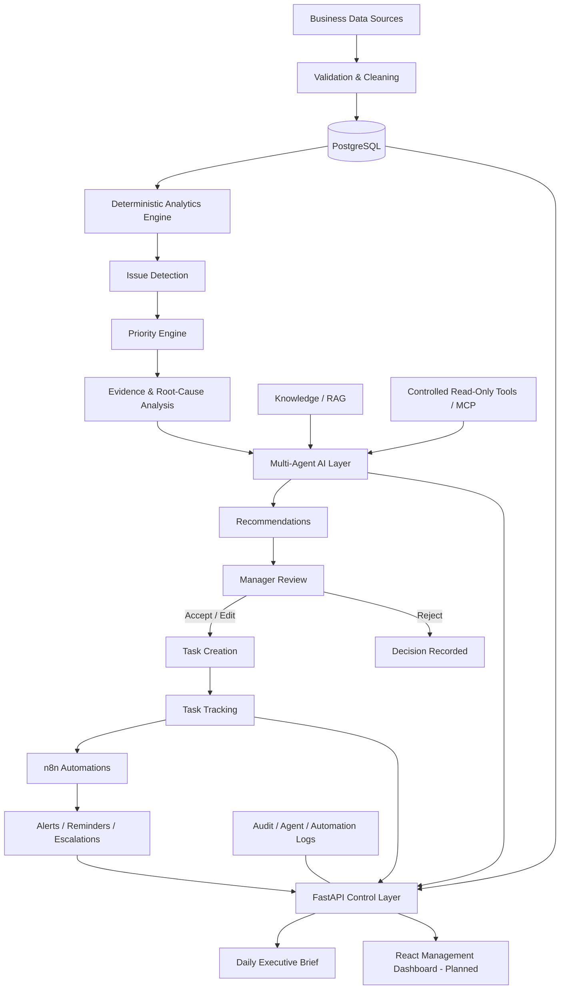

# AI-Powered Operating Intelligence Platform

> **A Multi-Agent AI Chief of Staff for Business Monitoring, Decision Support, and Workflow Automation**

An AI-powered operating intelligence platform that continuously turns fragmented business data into **prioritized issues, evidence-based root causes, actionable recommendations, manager-approved tasks, automated follow-ups, and executive intelligence**.

The project is built around a fictional retail/FMCG company, **SmartMart Retail Pvt. Ltd.**, and demonstrates how deterministic analytics, multi-agent AI, retrieval-augmented generation (RAG), controlled tool use, workflow automation, and human oversight can work together in an enterprise decision-support system.

---

## Table of Contents

- [Overview](#overview)
- [Business Problem](#business-problem)
- [What the Platform Does](#what-the-platform-does)
- [Why This Project Is Different](#why-this-project-is-different)
- [System Architecture](#system-architecture)
- [End-to-End Workflow](#end-to-end-workflow)
- [Implemented Capabilities](#implemented-capabilities)
- [Multi-Agent AI Layer](#multi-agent-ai-layer)
- [RAG and Controlled Tool Use](#rag-and-controlled-tool-use)
- [Human-in-the-Loop Decision Workflow](#human-in-the-loop-decision-workflow)
- [Data and Demo Environment](#data-and-demo-environment)
- [Technology Stack](#technology-stack)
- [Project Structure](#project-structure)
- [Testing and Reliability](#testing-and-reliability)
- [Security and Guardrails](#security-and-guardrails)
- [Running Locally](#running-locally)
- [Current Status](#current-status)
- [Planned Next Steps](#planned-next-steps)

---

## Overview

Traditional business dashboards are good at showing **what happened**, but managers still have to determine:

- What actually requires attention?
- Which problem is most important?
- Why did it happen?
- What evidence supports the conclusion?
- What action should be taken?
- Who should own the action?
- Has the action been completed?
- What needs executive attention today?

This project addresses that gap by building an **AI-powered operating intelligence layer** on top of business data.

Instead of stopping at dashboards and alerts, the platform is designed to move through the full decision-to-action cycle:

**Monitor → Detect → Prioritize → Explain → Recommend → Approve → Assign → Automate → Track → Brief**

---

## Business Problem

Businesses generate operational data across sales systems, inventory records, finance reports, customer complaints, vendor deliveries, spreadsheets, CRM systems, and other tools.

The problem is rarely a lack of data. The bigger problem is converting that data into **timely, trustworthy and actionable management decisions**.

A manager may have multiple dashboards but still need to manually:

1. Identify abnormal performance.
2. Decide which issue matters most.
3. investigate multiple data sources.
4. determine the likely root cause.
5. decide what action should be taken.
6. assign responsibility.
7. follow up with employees or teams.
8. track whether the issue was resolved.
9. summarize the situation for senior management.

The AI-Powered Operating Intelligence Platform brings these steps into one controlled workflow.

---

## What the Platform Does

The platform currently supports a backend workflow that can:

- Ingest and validate business data.
- Store operational data in PostgreSQL.
- Calculate business KPIs.
- Detect sales, inventory, complaint, vendor and finance risks.
- Consolidate detected issues.
- Prioritize issues based on business impact.
- Generate evidence-based root-cause analysis.
- Enhance analysis through specialized AI agents.
- Generate recommended management actions.
- Allow human review before actions are operationalized.
- Convert accepted recommendations into tasks.
- Track task and automation activity.
- Trigger alerts, reminders and escalations through n8n.
- Retrieve relevant organizational knowledge using RAG.
- Use controlled read-only business tools through an MCP-style tool layer.
- Generate Daily Executive Briefs.
- Maintain audit, automation and agent-run metadata.
- Support authenticated application users through an authentication foundation.

---

## Why This Project Is Different

### 1. It goes beyond dashboards

The platform does not only visualize KPIs. It connects monitoring with diagnosis, recommendation, task creation and workflow automation.

### 2. Deterministic analytics remain the factual foundation

Business calculations, thresholds, evidence and priority signals are produced through deterministic analytics.

LLMs enhance interpretation and communication rather than replacing the underlying business logic.

### 3. Evidence-first AI

Agents work with structured evidence, retrieved knowledge and controlled tool outputs instead of being given unrestricted access to operational systems.

### 4. Human-in-the-loop control

Recommendations do not automatically become business actions.

Managers can review decisions before approved recommendations are converted into executable tasks.

### 5. Decision-to-action workflow

The system connects intelligence with execution:

**Issue → Evidence → Recommendation → Approval → Task → Automation → Follow-up**

### 6. Controlled enterprise tool access

Read-only SQL, spreadsheet and CRM-style tools are exposed through controlled interfaces so agents can retrieve useful information without unrestricted database writes.

### 7. Auditable AI operations

Agent executions, tool calls, recommendations, tasks, imports, automations and important system activity are designed to be traceable.

---

## System Architecture



---

## End-to-End Workflow

```text
Business Data
    ↓
Data Validation & Cleaning
    ↓
PostgreSQL Source of Truth
    ↓
KPI & Deterministic Analytics
    ↓
Issue Detection
    ↓
Priority Ranking
    ↓
Evidence Collection
    ↓
Root-Cause Analysis
    ↓
Multi-Agent AI Enhancement
    ↓
Action Recommendations
    ↓
Manager Accept / Edit / Reject
    ↓
Approved Task Creation
    ↓
Task Tracking
    ↓
n8n Alerts / Reminders / Escalations
    ↓
Automation & Audit Logs
    ↓
Daily Executive Brief
    ↓
React Management Dashboard (Planned)
```

---

## Implemented Capabilities

### Data Engineering and Validation

The project includes a complete data foundation for the SmartMart demo environment:

- Raw-data preservation.
- Data cleaning and standardization.
- Processed-data validation.
- Foreign-key validation.
- Duplicate and missing-value checks.
- Date and numeric validation.
- Business-rule validation.
- Database loading.
- Import logging.
- Reusable data-management services.

Raw and processed datasets remain separated so data transformations can be traced.

---

### PostgreSQL Data Layer

PostgreSQL is the primary source of truth for both business data and platform workflow data.

Business domains include:

- Products
- Stores
- Vendors
- Employees
- Sales
- Inventory
- Customer complaints
- Finance
- Vendor deliveries

The platform also maintains workflow/system information for areas such as:

- Detected issues
- Issue evidence
- Recommendations
- Tasks
- Executive briefs
- Agent runs
- Automation logs
- Audit logs
- Data import logs
- Application-user authentication

---

### Deterministic Analytics Engine

The deterministic analytics layer provides the factual foundation used by the agents.

Implemented analytics cover:

- KPI calculation
- Sales performance
- Store underperformance
- Inventory risk
- Low-stock detection
- Overstock detection
- Customer complaint analysis
- Vendor performance
- Delivery delays
- Finance risk
- Priority scoring
- Executive priority selection
- Evidence-based root-cause analysis
- Manager priority lists

The separation between deterministic analysis and generative AI reduces the risk of allowing an LLM to invent critical business calculations.

---

### FastAPI Backend

FastAPI provides the application/control layer around analytics, data management, executive intelligence and knowledge services.

The backend architecture includes:

- API routers
- Pydantic schemas
- Service layer
- Database models
- Analytics services
- AI agents
- LLM provider abstraction
- Knowledge/RAG services
- Authentication and security utilities
- Task and automation services
- Audit and run metadata

This separates business logic from transport/API concerns and makes the project easier to test and extend.

---

## Multi-Agent AI Layer

The platform uses specialized agents rather than relying on one unrestricted general-purpose prompt.

### Monitoring Agent

Interprets monitoring signals and business anomalies generated by the analytics layer.

### Priority Agent

Helps explain and communicate which issues deserve management attention first.

### Root Cause Agent

Enhances deterministic root-cause findings using the available evidence and controlled context.

### Recommendation Agent

Generates actionable management recommendations from validated issues and evidence.

### Executive Brief Agent

Transforms operational intelligence into concise management-level summaries.

---

### LLM Integration

The AI layer includes infrastructure for:

- LLM provider abstraction
- Provider/model metadata
- Prompt management and versioning
- Token usage tracking
- Estimated cost tracking
- Latency tracking
- Tool-call metadata
- Fallback handling
- Error classification
- Agent-run logging

A live controlled-tool validation has also been performed using a Groq-backed LLM workflow.

---

## RAG and Controlled Tool Use

### Knowledge / RAG

The platform contains a knowledge layer for grounding AI responses in organizational documents and supporting information.

The knowledge workflow supports:

- Document ingestion
- Validation
- Knowledge retrieval
- Read-only contextual use
- Grounded agent responses

RAG complements structured PostgreSQL evidence by giving agents access to relevant unstructured organizational knowledge.

---

### Controlled Tools / MCP

The platform implements controlled read-only tools for external business information.

Current controlled tool categories include:

- SQL read
- Excel/spreadsheet read
- CRM-style read

The tool layer is designed around an important principle:

> **Agents may retrieve the information they need, but they should not receive unrestricted authority to modify operational systems.**

This creates a safer foundation for enterprise AI tool use.

---

## Human-in-the-Loop Decision Workflow

AI recommendations are not treated as automatically approved decisions.

The platform supports a manager-controlled workflow:

```text
Recommendation
      ↓
Manager Review
      ↓
┌─────────────┬─────────────┬─────────────┐
│   Accept    │    Edit     │   Reject    │
└─────────────┴─────────────┴─────────────┘
      ↓              ↓
Approved Recommendation
      ↓
Task Creation
      ↓
Task Tracking
      ↓
Automation
```

This design keeps accountability with the human decision-maker while still allowing AI to reduce analysis and coordination effort.

---

## Task and Workflow Automation

Approved recommendations can be transformed into operational tasks.

Task workflows support management of work such as:

- Ownership
- Status
- Due dates
- Follow-up
- Completion
- Overdue identification
- Automation triggers

n8n is used as the workflow-automation layer.

Example automation workflows include:

- High-priority issue alerts
- Task reminders
- Overdue-task escalations

Automation activity is recorded so system-triggered actions remain traceable.

---

## Daily Executive Brief

The platform can generate management-oriented executive briefs that consolidate information from multiple operating layers.

A brief can include:

- KPI snapshot
- Highest-priority issues
- Root causes and supporting evidence
- Recommended actions
- Pending management decisions
- Task progress
- Blocked or overdue work
- Automation activity
- Key management attention points

The objective is to give a manager a compact operating view rather than requiring them to inspect multiple dashboards and reports independently.

---

## Authentication and Security Foundation

The backend includes an application authentication foundation with:

- Application-user model
- Authentication schemas
- Password security utilities
- Credential-validation service
- Database support
- Administrative user-creation tooling
- Automated authentication tests

This provides the groundwork for protected application access and future role-based authorization.

---

## Data and Demo Environment

### Demo Company

**SmartMart Retail Pvt. Ltd.**

SmartMart is a fictional retail/FMCG superstore business created specifically for this project.

The synthetic environment represents multiple stores, vendors, employees, products, sales transactions, inventory records, customer complaints, finance records and vendor deliveries.

### Data Period

**January 1, 2026 – June 30, 2026**

### Dataset Scale

The project integrates **9 relational datasets containing 46,000+ records**.

| Dataset | Records | Purpose |
|---|---:|---|
| Products | 25 | Product, pricing, cost, reorder and vendor information |
| Stores | 10 | Store, location, management and target information |
| Vendors | 10 | Supplier, rating, payment and delivery information |
| Employees | 25 | Employee, department, role and store assignments |
| Sales | 44,435 | Product-level retail transactions |
| Inventory | 250 | Store-product stock and inventory-risk information |
| Complaints | 1,572 | Customer complaints, severity, assignment and resolution |
| Finance | 60 | Store-level monthly revenue, cost, profit and financial-risk data |
| Vendor Deliveries | 85 | Purchase-order, delay, delivery and vendor-quality information |

**Total records: 46,472**

---

## Example Business Scenarios

The synthetic data intentionally contains business problems so the intelligence workflow can be tested against realistic situations.

Examples include:

- Significant sales decline at a store.
- Low-stock risks affecting selected products.
- Overstock situations.
- High complaint volume.
- Financial-risk indicators.
- Vendor delivery delays.
- Reduced vendor quality performance.
- Target-achievement issues.

These scenarios allow the system to demonstrate not just reporting, but issue prioritization, root-cause reasoning and management action generation.

---

## Technology Stack

### Backend and Data

- Python
- FastAPI
- Pydantic
- SQLAlchemy
- PostgreSQL
- Pandas
- NumPy

### AI and Intelligence

- Multi-agent AI architecture
- LLM provider abstraction
- Groq integration
- Retrieval-Augmented Generation (RAG)
- Controlled MCP-style tool layer
- Prompt/version metadata
- Agent-run observability

### Automation

- n8n
- Task workflows
- Alerts
- Reminders
- Escalations

### Testing

- Pytest
- FastAPI TestClient
- Separate test database safety controls

### Development

- Git
- GitHub
- Visual Studio Code

### Frontend Direction

- React
- API-driven management dashboard
- Kanban-style task interface

---

## Project Structure

```text
AI-Powered-Operating-Intelligence-Platform/
│
├── backend/
│   ├── analytics/              # Deterministic business analytics
│   ├── app/
│   │   ├── agents/             # Specialized AI agents
│   │   ├── core/               # Core configuration and security
│   │   ├── llm/                # LLM providers, prompts and metadata
│   │   ├── models/             # Database models
│   │   ├── routers/            # FastAPI routes
│   │   ├── schemas/            # Request/response schemas
│   │   └── services/           # Application services
│   │
│   ├── data_cleaning.py
│   ├── data_validation.py
│   ├── processed_data_validation.py
│   └── load_processed_data.py
│
├── data/
│   ├── raw/
│   ├── processed/
│   └── synthetic/
│
├── database/
│   ├── schema.sql
│   ├── system_tables.sql
│   ├── auth_foundation.sql
│   ├── erd.md
│   ├── erd.dbml
│   ├── erd.png
│   ├── data_dictionary.md
│   └── sample_queries.sql
│
├── docs/                       # Project and architecture documentation
├── n8n/
│   └── workflows/              # Workflow automation definitions
├── notebooks/                  # Exploration and analysis notebooks
├── reports/                    # Generated analysis/validation reports
├── scripts/                    # Utility and validation scripts
├── tests/                      # Automated test suite
│
├── .env.example
├── .gitignore
├── README.md
└── requirements.txt
```

---

## Testing and Reliability

Automated testing is used across the platform rather than validating only individual scripts manually.

The test suite covers areas including:

- Analytics
- KPI calculations
- Issue workflows
- Data imports
- Data validation
- Agent behavior
- LLM-enhanced workflows
- Agent-run metadata
- Knowledge/RAG
- Recommendations
- Tasks
- Automation
- Executive briefs
- Authentication

### Current Regression Baseline

```text
580 passed
1 dependency deprecation warning
```

The full regression suite currently passes successfully.

---

## Security and Guardrails

The project incorporates several safeguards suitable for an enterprise-style AI workflow:

- Secrets are stored locally through environment variables.
- `.env` is excluded from GitHub.
- `.env.example` provides a safe configuration template.
- Business calculations remain deterministic.
- AI outputs are grounded in evidence.
- Controlled business tools are read-only.
- Agents do not receive unrestricted database-write access.
- Human approval is required before recommendations become operational tasks.
- Agent runs and important workflow actions are logged.
- Automation activity is recorded.
- Authentication utilities protect user credentials.
- Test-database safety controls reduce the risk of running destructive tests against the primary database.

---

## Running Locally

### Prerequisites

Install:

- Python 3.12+
- PostgreSQL
- Git
- n8n for workflow-automation testing

### 1. Clone the Repository

```powershell
git clone https://github.com/AkhileshJoshi10/AI-Powered-Operating-Intelligence-Platform.git
cd AI-Powered-Operating-Intelligence-Platform
```

### 2. Create and Activate a Virtual Environment

```powershell
python -m venv venv
.\venv\Scripts\Activate.ps1
```

### 3. Install Dependencies

```powershell
pip install -r requirements.txt
```

### 4. Configure Environment Variables

Use `.env.example` as the configuration reference and create your local `.env`.

Do **not** commit credentials, API keys or database passwords.

### 5. Prepare PostgreSQL

Create the local database:

```text
ai_operating_intelligence
```

Apply the relevant SQL scripts under `database/` for the business schema, system tables, authentication foundation and subsequent migrations.

### 6. Start the FastAPI Backend

```powershell
uvicorn backend.app.main:app --reload --env-file .env
```

Default local API address:

```text
http://127.0.0.1:8000
```

### 7. Run the Automated Tests

```powershell
pytest -q
```

### 8. Start n8n When Testing Automations

```powershell
n8n start
```

Default local n8n address:

```text
http://localhost:5678
```

---

## Current Status

The project is in **active development**.

The core backend operating-intelligence workflow is implemented across:

- Data engineering
- PostgreSQL
- Deterministic analytics
- Issue prioritization
- Root-cause analysis
- FastAPI
- Multi-agent AI
- LLM integration
- RAG
- Controlled tools
- Human approval workflows
- Task management
- n8n automation
- Executive briefs
- Authentication foundation
- Automated testing

The next major product layer is the user-facing management experience.

---

## Planned Next Steps

The main remaining product work includes:

- Complete protected API access and role-based authorization.
- Build the React management dashboard.
- Build the visual Kanban task-management interface.
- Connect dashboard views to the existing FastAPI services.
- Surface issues, evidence, recommendations, approvals, tasks and executive briefs in one UI.
- Complete end-to-end product integration and demo workflows.
- Prepare deployment and production-oriented configuration.

---

## Project Vision

The long-term goal is to create an **AI operating layer for managers**.

Rather than requiring managers to continuously inspect disconnected dashboards, reports, spreadsheets and operational systems, the platform is designed to continuously answer:

> **What needs my attention, why does it matter, what should we do about it, and has it been handled?**

That is the role of the AI Chief of Staff in this project.

---

## Author

**Akhilesh Joshi**  
MBA — AI & Data Science

---

> This project uses synthetic business data created for educational and portfolio purposes. No real customer, employee, vendor or company operational data is included.
